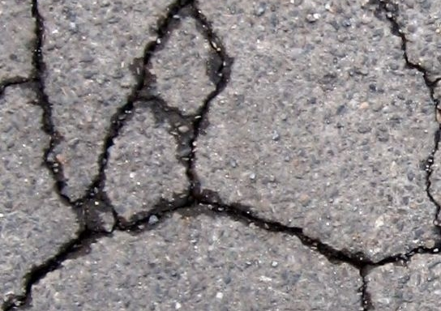

# Structured Segmentation

## Setup
Installation is done by cloning the repository
```bash
git clone https://github.com/FMuenke/structured_segmentation.git
```
All dependency can be installed with
````bash
pip install -r requirements.txt
````
It is strongly recommended to use a virtual environment (like anaconda).

## Example

An encoder-decoder model was used to segment cracks in images.

Input Image:



Ground-Truth (right) / Result (left):


## Documentation

In this repository there are multiple layer implemented.
The Layer can be stacked and used as one end-to-end trainable model.

Learning Layer:
* GraphLayer
* SuperPixelLayer
    + INPUTS : previous layers as list or as layer object
    + name : Identifying Name
    + super_pixel_method="slic" : Method used to create SuperPixels [slic, patches, felzenszwalb, quickshift, watershed]
    + down_scale=0 : Octave used to downscale relative to the initial input
    + feature_aggregation="quantiles",
    + clf="b_rf",
    + clf_options=None,
    + param_grid=None,
    + data_reduction=0
* ShapeRefinementLayer

Helper Layer:
* VotingLayer
* BottleNeckLayer
* NormalizationLayer
* InputLayer

In addition this repository provides three pre configured layer configurations (models)

Models:
* EncoderDecoder
* PyramidBoosting
* RandomStructuredRandomForrest
* PatchWork