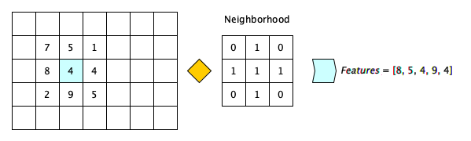

# Structured Segmentation

[[paper]](https://www.degruyter.com/document/doi/10.1515/cdbme-2023-1048/html)

## Introduction

This repository provides a lightweight framework, 
that can be used to build semantic segmentation models based on structured classifiers.
The frameworks implements structured classifiers as independent layers, which can be easily combined with another to 
create powerful end-to-end trainable semantic segmentation models.

Structured Classification refers to an image segmentation technique, that aims to classify each individual pixel.
Each pixel has an assigned class based on the provided segmentation mask, and features that are assigned to a pixel
based on a previously defined neighborhood. The neighborhood works as depicted in the following figure:



For a given pixel the neighborhood is applied and all positions with a 1 are collected and added to the features,
while zeros are ignored. This is applied for all pixels on an image. Afterwards a classifier is trained using the 
described dataset and applied to all pixels during inference.

This framework enables the user to create models themselves but already provides pre-configured models.
- Structured Classifier Model: A single Structured Segmentation Algorithm.
- Encoder Decoder Model: An ensemble of multiple Structured Segmentation Algorithms


### Structured Classifier Model (SC)
The Structured Classifier Model (SC) is the simplest version of a structured classification model. We use on single
structured classification unit to process the whole image. Due to the limited scale of the kernel the model is unable
to understand a larger context of the image.


### Encoder Decoder Model (ED)


The Encoder Decoder Model (ED) is an ensemble of six Structured-Classifier-Models (SC), where each provides its output 
to the next SC. Each SC collects it features from a different scale of the image. The first three SC downscale
the image each by half while the next three upscale back to its original resolution. We prevent overfitting 
and reduce training time by randomly sampling only one-third of all available training images per SC.
We can adjust the ED to add more down- and up-scaling stages.


## Performance Evaluation


<a id="1">[1]</a> 
A. Mahbod et al. (2021). 
CryoNuSeg: A Dataset for Nuclei Instance Segmentation of Cryosectioned H&E-Stained Histological Images
Computers in Biology and Medicine , Vol. 132 p. 104349.

<a id="1">[2]</a>
C. Edlund et al. (2021)
LIVECell—A large-scale dataset for label-free live cell segmentation
Nature Methods , Vol. 18, No. 9

<a id="1">[3]</a> 
N. Codella et al. (2018). 
Skin Lesion Analysis Toward Melanoma Detection: A Challenge at the 2017 International Symposium on Biomedical Imaging (ISBI), Hosted by the International Skin Imaging Collaboration (ISIC)
arXiv1710.05006.

<a id="1">[4]</a> 
O. Ulucan et al. (2020)
A Large-Scale Dataset for Fish Segmentation and Classification
2020 Innovations in Intelligent Systems and Applications Conference (ASYU)

<a id="1">[5]</a>
A. Popova et al. (2019)
Facile One Step Formation and Screening of Tumor Spheroids Using Droplet-Microarray Platform 
Small , Vol. 15, No. 25

## Setup
Installation is done by cloning the repository
```bash
git clone https://github.com/FMuenke/structured_segmentation.git
```
All dependency can be installed with
````bash
pip install -r requirements.txt
````
It is strongly recommended to use a virtual environment (like anaconda).

## Example

An encoder-decoder model was used to segment cracks in images.

Input Image:


Ground-Truth (left) / Result (right):


## Tutorial
In the following we explain briefly how to train and evaluate a model yourself.
````python
import os
from data_structure.segmentation_data_set import SegmentationDataSet
from model import EncoderDecoder
from utils.utils import save_dict, check_n_make_dir

color_coding = {
    "class_1": [
      [255, 255, 255], #  Color Code of Class 1 on segmentation mask
      [255, 0, 0]      #  Color Code used for displaying results
    ],
    "class_2": [
      [4, 4, 4],       #  Color Code of Class 2 on segmentation mask
      [255, 0, 0]      #  Color Code used for displaying results
    ],
}

data_folder_train = "PATH_TO_TRAIN_DATA"
data_folder_test = "PATH_TO_TEST_DATA"
model_folder = "PATH_TO_STORE_MODEL"

model = EncoderDecoder()

data_set = SegmentationDataSet(data_folder_train, color_coding)
train_set = data_set.get_data()

check_n_make_dir(model_folder)
model.fit(train_set)
model.save(model_folder)
save_dict(color_coding, os.path.join(model_folder, "color_coding.json"))

data_set = SegmentationDataSet(data_folder_test, color_coding)
test_set = data_set.get_data()
model.evaluate(test_set, color_coding, results_folder=model_folder)

````

## Citation

If you want to use this repository for your own research, please cite the following paper:

````
@article{muenke2023,
    url = {https://doi.org/10.1515/cdbme-2023-1048},
    title = {A Lightweight Framework for Semantic Segmentation of Biomedical Images},
    title = {},
    author = {Friedrich Rieken Münke and Luca Rettenberger and Anna Popova and Markus Reischl},
    pages = {190--193},
    volume = {9},
    number = {1},
    journal = {Current Directions in Biomedical Engineering},
    doi = {doi:10.1515/cdbme-2023-1048},
    year = {2023},
    lastchecked = {2023-09-26}
}
````